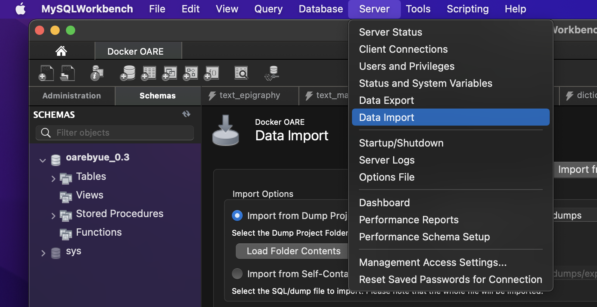

# OARE Web

This is a monorepository containing all code necessary to run oare.byu.edu. This guide will explain how to setup the project locally and other information you will need to know as a developer on the project.

## Install Docker

This project uses Docker for local development. If you are not familiar with Docker, it essentially provides the same environment for the app regardless of your operating system. Docker will run the frontend, backend, and database pieces of the web app in Linux containers. At the moment it is only used for local development.

First, download Docker at this link: https://www.docker.com/products/docker-desktop. After downloading Docker, you will need to start the Docker Daemon. See the following instructions depending on your operating system.

### Mac

Search for Docker in the finder and click on the first result.


You should see a little whale icon at the top of your screen. Once it stops moving, Docker is running.


### Windows

## Run the project

You will need to be added as a collaborator to the Github project before you can download the code. If you have not already been added as a collaborator, please ask Brett to do so.

You will

First clone the repository (if you are on Windows, you will need to download Git first):

```
$ git clone https://github.com/oaregithub/oare_mono.git
```

If you would prefer to use SSH to push your code, talk to Brett and he can add your SSH key to the repository.

Next, use Docker to start up the project:

```
$ docker-compose build
$ docker-compose up -d
```

It might take a few minutes to build the first time because Docker needs to install the required images. Running `docker-compose up -d` runs the app in detached mode, so you won't have to run these commands again unless the Docker daemon stops. Hot reloading is also enabled, so when you make changes to your local copy of the project, they will be synced to the Docker containers and hot reloaded in your browser.

## Create a local copy of the database

Now you should have three Docker containers running - one for the frontend, one for the backend, and one with a MySQL server. The MySQL server won't contain anything, so we need to import a copy of the database to that container.

You will need a client that can connect to the MySQL container. We recommend [MySQL Workbench](https://dev.mysql.com/downloads/workbench/), but if you prefer some other client then that's fine too. Just note that these instructions are written for MySQL Workbench and we might have a hard time helping you if you're having problems with some other client.

First, create a new connection in MySQL Workbench.


Give your connection a name. For example, you could put "Docker OARE". For "Hostname", put localhost. Click "Test Connection". You will be asked for a password. The password is "example" (without the quotes). Note that we do not use Docker in production, so it's ok that the password is hardcoded in the Docker Compose file.

Click "Ok", then click on your connection name.

Now you will need to ask Jon or Brett for a SQL dump of the database. Click on the blue folder near the top of the screen and select the file you were given.



You will get a warning about the file being large. Just click the "Run SQL Script..." button so that MySQL Workbench doesn't try and display the entire file contents in its GUI.

This will take a while (there are over 15 million rows!). It might take a couple of hours, so be patient.

Once the database import finishes, everything should work as expected. In your browser, navigate to http://localhost:8080 and you should see the site. Spend some time getting familiar with the site itself. Everything is running locally, so don't be afraid of messing anything up.

If you're just trying to get the project running locally, then that's all you need to know from this guide. The following sections are developer-specific items.

## AWS

The oare.byu.edu site itself runs on an EC2 instance on AWS. Ask Brett to give you AWS access.

If you will be a tech lead on this project, you don't really need to know too much about AWS, but some working knowledge will be helpful. Most of the time, the only AWS dashboards you'll need to use will be Elastic Beanstalk and RDS.

### Elastic Beanstalk

Elastic Beanstalk basically automates the process of providing an EC2 instance and load balancer for the site. Most of the time you won't have to do anything here since the site automatically gets deployed to Elastic Beanstalk when your code is merged into the master branch of the Git repository.

If you do need to change something in EB, it will most likely be environment variables. For example, you should routinely change the password to the database. When you do, you will need to update the OARE_DB_URL environment variable with the new password value.
