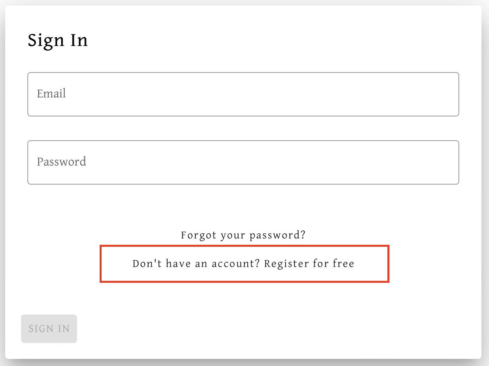
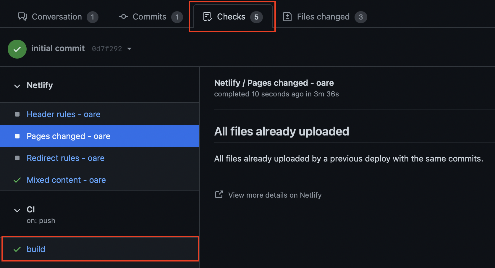

# Welcome to OARE

Welcome to the Old Assyrian Research Environment project! We're glad you're here and are excited to get to work. On this page, you can find information for getting started on the project and running the site on your local machine. Please take the time to review everything on this page before getting started. The live site can be accessed at https://oare.byu.edu.

Once again, we're glad you are on the team. The codebase is growing in size and complexity. We understand that it's going to take some time for you to familiarize yourself with the code, the conventions we follow, and the goals of the project. We'll do our best to give you a good overview and guide you along as you get started, but don't be afraid to reach out with any questions you might have.

## Languages and Frameworks

This is a full-stack project. As such, you'll be writing code for both the frontend views and the backend server, as well as interfacing with the SQL database that serves as the backbone of the project.

On the frontend, we primarily use [Vue.js](https://vuejs.org), a framework that simplifies frontend logic and allows us to create reusable and scalable components. Specifically, we make use of the [Vue Composition API](https://v3.vuejs.org/guide/composition-api-introduction.html#why-composition-api). When compiled, Vue turns the code we write into valid HTML, CSS, and Javascript for use on the end browser. Additionally, to simplify our work, we use [Vuetify](https://vuetifyjs.com/en/), a Vue framework that makes applying Material Design language components extremely easy. By doing so, we can avoid tedious work in CSS by using pre-built UI components.

On the backend, we use [Node.js](https://nodejs.org/en/), a Javascript runtime environment commonly used on servers. Using a package called [Express](https://expressjs.com), we are able to easily write REST APIs to interact with the data we need. We utilize the [Knex.js](https://knexjs.org) framework to wrap SQL statements and interface with the SQL databse.

On both the frontend and the backend, as well as in other parts of the project, we use [TypeScript](https://www.typescriptlang.org) code rather than vanilla Javascript. TypeScript is a superset of Javascript, meaning that all valid Javascript is valid TypeScript, but some additional features, such as strict typing enforcement, have been added. When compiled, TypeScript code is converted to Javascript for use in the browser environment. If you are unfamiliar with TypeScript, take some time to familiarize yourself as it is the primary language in the codebase. Documentation for TypeScript can be found [here](https://www.typescriptlang.org/docs/).

## Communication

We use a number of different applications to communicate and work on the project. Our codebase, project steps, and code assignments are all found in this Github repository. Take some time to familiarize yourself with the repo. We primarily communicate about the project via Slack. If you haven't been added to the Slack workspace, ask the team lead or Dr. Stratford to add you.

In addition to asynchronous work, we also have weekly in-person team meetings and regular individual check-ins with the team lead via Zoom. You will receive details about these meetings within the first few weeks of your start date.

## Style Guide

Our project primarily follows the [Javascript style guide created by Airbnb](https://github.com/airbnb/javascript). However, you may find that there are a few things that we do slightly differently. To help us enforce this style guide, we use ESLint and Prettier formatting tools, but they are not perfect. Do your best to familiarize yourself with the style guide and follow it as best as you can. In any case, if you accidentally miss something, the team lead will be happy to help you out during code review.

To check whether your code abides by the existing linting rules, simpy run `yarn lint` in the terminal. Doing so will give you a detailed view of any lines in the code that are not formatted correctly. Running `yarn lint:fix` will fix the majority of these errors automatically, but more complex errors may require manual edits. When pushed to Github, every branch undergoes several test actions, including linting. Code that does not pass the linting cannot be merged, so taking the time to check linting regularly beforehand can be beneficial.

## IDE Recommendation

We recommend using [Visual Studio Code](https://code.visualstudio.com) as your IDE when developing for the project. Though not required, VS Code has excellent integration with TypeScript and a number of great extensions that make developing for our project easier. If you choose to use another IDE, you may do so, but we might not be able to help you get things working properly.

### Recommended VS Code Extensions

- [Docker](https://marketplace.visualstudio.com/items?itemName=ms-azuretools.vscode-docker) - Enables Docker container management.
- [ESLint](https://marketplace.visualstudio.com/items?itemName=dbaeumer.vscode-eslint) - Integrates ESLint, a tool we use to maintain code rules and consistency.
- [Formatting Toggle](https://marketplace.visualstudio.com/items?itemName=tombonnike.vscode-status-bar-format-toggle) - Adds a toggle to the VS Code options to enable/disable formatting. We rely heavily on auto-formatting.
- [Prettier](https://marketplace.visualstudio.com/items?itemName=esbenp.prettier-vscode) - Implements Prettier auto-formatting, helping to keep syling consistent.
- [Vetur](https://marketplace.visualstudio.com/items?itemName=octref.vetur) - Adds Vue tooling and autocomplete to the editor.

### Recommended VS Code Settings

Make sure to have the following settings enabled. They add support for auto-formatting for the project.

- Editor: Format on Paste
- Editor: Format on Save
- Editor: Format on Type

## Running the Project Locally

This is a monorepository containing all code necessary to run oare.byu.edu. This guide will explain how to set up the project locally and contains other information you will need to know as a developer on the project. The instructions vary slightly for Mac and Windows users, so be sure to follow the directions carefully. If you are using Windows, a few extra steps may be necessary.

### Create an OARE Account

In order to access all parts of the website, you will need to have an admin account on the project website. To do so, navigate to the [site](https://oare.byu.edu) and click "Login" at the top right.


Then select the "Register for free" option.



Fill out the form to create a new user account using the credentials of your choice. Once your account is created, ask the team lead to grant you administrator permissions. This will allow you to access all parts of the website.

### Install WSL 2 (Windows Only)

Running this project locally on a Windows machine will require WSL 2 to be installed. WSL, short for Windows Subsystem for Linux, is a utility created by Microsoft that allows you to run a full Linux environment on your machine. With WSL installed, your machine will be able to handle all of the packages and commands that our project uses.

If you are using a Mac, you can skip this step. Because macOS is UNIX-based, all the necessary commands will run properly by default.

For most PC machines, simply open Powershell as Administrator and run the following command to install WSL:

```
wsl --install
```

This command will download WSL, set version 2 as the default (version 2 is required for our project to work), and set Ubuntu as the default Linux distribution. On most machines, this will work properly. If it does not work on your PC, follow the detailed instructions [here](https://docs.microsoft.com/en-us/windows/wsl/install-manual) to install WSL 2 manually. Make sure to set the default version to WSL 2.

### Install Docker

This project uses Docker to locally run a MySQL server. If you are not familiar with Docker, it lets you run apps inside of "containers", which are kind of like very lightweight virtual machines.

First, download Docker at this link: https://www.docker.com/products/docker-desktop. After downloading Docker, you will need to start the Docker Daemon. See the following instructions depending on your operating system.

#### Mac

Search for Docker in Spotlight Search or the Application Launchpad and click on the first result.


You should see a little whale icon in the status bar. Once it stops moving, the Docker Daemon is running.


#### Windows

Search for the Docker application and open it. If WSL 2 is not properly installed, an error will appear on startup. Make sure WSL 2 is installed properly before proceeding.

In the system tray at the bottom-right of your screen, a whale icon should appear. It may appear in the submenu accessed via the arrow icon. Once the whale icon stops moving, the Docker Daemon is running.

### Get Access to the Github Repository

If you do not have a Github account, create one. Then, add an SSH key to your account so you have command line access by following [these instructions](https://docs.github.com/en/github/authenticating-to-github/adding-a-new-ssh-key-to-your-github-account).

You will need to be added as a collaborator to the Github project before you can download the code. The team lead will need to invite you and you will need to accept the invitation in your email.

#### For the Team Lead

To add someone as a collaborator to the project, you will need to sign into the oaregithub account on Github. Navigate to the oare-mono project, and then click on Settings.


Now click on "Invite a collaborator" and type the email or Github username of the new collaborator.


The new collaborator will need to accept the invitation sent to their email, and then they will have read/write access to the repository.

### Set up AWS

User authentication for the website is done with Firebase, an easy-to-use development toolkit created by Google. A private key for Firebase is stored in an S3 bucket on AWS. As such, the site will not work locally unless you have AWS access. You will also need to configure the `aws` command line utility.

The team lead will create an AWS account for you. This will allow you to access the AWS console where the site is hosted. Once the team lead creates the account, you will receive an email with login instructions. You will be asked to change your password the first time you access the console. Once your account is active, you will be ready to configure the `aws` command line utility.

First, install the `aws` CLI by following [these instructions](https://docs.aws.amazon.com/cli/latest/userguide/install-cliv2.html). The instructions are slightly different for each operating system, so be sure to follow the correct instructions.

Next, make sure you have your AWS access key ID and secret access key. The team lead will give these to you when you are added as a user in AWS.

The easiest way to configure your account is to run `aws configure` from the command line, and then input your keys. For more information, see [this documentation](https://docs.aws.amazon.com/cli/latest/userguide/cli-configure-quickstart.html).

#### For the Team Lead

You will need to create an IAM account in AWS for the new developer. In the IAM dashboard, click "Users" and then "Add user".


Create a user name (can just be the developer's first and last name), then check both the "Programmatic access" and "AWS Management Console access" boxes. Leave the "Autogenerated password" radio button selected, and leave the "User must create a new password at next sign-in" box checked. Click "Next: Permissions".

Add the user to the "OareCoderAdmin" group then click "Next: Tags". Click "Next: Review". Finally, click "Create user". Make sure to send the new developer the access key ID, secret access key, and password. Make sure they can log in to the AWS console with the password.

### Clone the Repository

First, clone the repository in the directory of your choice. You will be asked to authenticate using your Github credentials.

```
git clone https://github.com/oaregithub/oare_mono.git
```

Now change directories into the project.

```
cd oare_mono
```

### Configure Docker Container

The monorepository contains several Docker configuration files. These files tell Docker what container images are necessary for the project to run. In our case, a `mysql` container is needed to host the local copy of the database. Before we can create that local copy of the database, we need Docker to download and configure the appropriate container image.

To configure the Docker container, simply run the following commands within the project directory:

```
docker-compose build
docker-compose up -d
```

It might take a few minutes to build the first time because Docker needs to install the required images. Running `docker-compose up -d` runs the app in detached mode, so you won't have to run these commands again unless the Docker container is uninstalled or reset.

### Create Database Connections

You should now have a MySQL server running in a Docker container. However, it will be empty, so we need to populate it with real data.

You will need a client that can connect to the MySQL container. We recommend [MySQL Workbench](https://dev.mysql.com/downloads/workbench/), but if you prefer some other client then that's fine too. Just note that these instructions are written for MySQL Workbench and we might have a hard time helping you if you're having problems with some other client.

You will want to create three connections in MySQL Workbench - a connection to the production database, a readonly connection to the production database, and a local connection to the local database used for development. You can name each connection whatever you want, but make sure to configure the connections as directed below.


#### Production and Read-only Connections

For the production connection, create a new connection with a name of your choice. The hostname is "oare-0-3.c4t2up2es1cx.us-west-2.rds.amazonaws.com" (without the quotes). The username is "oare". Ask another team member for the password.

For the readonly connection, create another connection with a name of your choice. The hostname is the same as the production connection and the username is "oare_readonly". Again, ask another team member for the password. We recommend clicking the box that says "Store in keychain" so you don't have to type the password in every time you want to connect.

#### Create a Local Copy of the Database

Create another connection using a name of your choice. We recommend a name like "Docker OARE" or "Local OARE" to help differentiate between the local copy and the production copies. For "Hostname", put "localhost". Click "Test Connection". You will be asked for a password. The password is "example" (without the quotes). Note that we do not use Docker in production, so it's ok that the password is hardcoded in the codebase.

Now, you will need to export a copy of the production database so you can use it locally. In MySQL Workbench, open your production connection. Then go to Server > Data Export


Select the oarebyue_0.3 schema and make sure all the tables are selected. Make sure all the checkboxes are checked under the "Objects to Export" section. Also make sure the "Create Dump in a Single Transaction" and "Include create schema" boxes are checked. Choose a location to save the dump, and then click "Start Export".


This could take a little while. Once the export is complete, you will need to import the exported database into your local database. Open the local database connection then go to Server > Data Import.


Select "Import from Self-Contained File" and choose the file that you exported in the last step. Then click "Start Import"


This will take a while (there are over 15 million rows!). It might take a couple of hours, so be patient.

### Install Node.js and Yarn Package Manager

Running this project requires you to have [Node.js](https://nodejs.org/en/) and [Yarn Package Manager](https://yarnpkg.com) installed on your machine. If you don't already have them installed, follow the instructions below.

#### Mac

There are multiple ways to download and install Node.js and Yarn. You can choose to install them however you choose following the various instructions on the Node.js and Yarn installation pages. However, the instructions below outline how to install the packages using Homebrew, which is the method we recommend.

Install Homebrew Package Manager by following the instructions on the [Homebrew site](https://brew.sh).

Once Homebrew is installed, run the following script:

```
brew install yarn
```

This command will install both Yarn Package Manager and Node.js (if not previously installed).

#### Windows

There are multiple ways to download and install Node.js and Yarn. You can choose to install them using whatever method we choose. However, the instructions below outline the method that we recommend.

First, download the Windows Node.js installer [here](https://nodejs.org/en/).

Once Node.js is installed, run the following command to install Yarn:

```
npm install --global yarn
```

### Run the Project

First, in the terminal, navigate to the directory where the project codebase is located.

Next, install dependencies and build the project:

```
yarn install
yarn build
```

Finally, start the local server:

```
yarn start
```

In your browser, navigate to http://localhost:8080 and you should see the site. Login using the account you created earlier and spend some time getting familiar with the site itself. Everything is running locally, so don't be afraid of messing anything up.

## Workflow Processes

As you know, this team primarily works asynchronously, meaning that there are no set work hours. You may complete assigned tasks at your convenience, but try your best to put in as many hours as you can (within the limits discussed in your interview). If you have any questions regarding hours or scheduling, contact Dr. Stratford.

This section will outline the general process that you will follow to complete tasks in the project. Of course, it may vary from time to time given the specifics of the tasks assigned, but this guide will serve as a useful template for most assignments.

### Regularly Update Local Code and Database

Because multiple team members are making changes to the code and the contents of the database on a regular basis, it's important that you keep your local copies up-to-date. If you don't update the code and database regularly, you will eventually experience merge conflicts and/or unexpected database behavior.

#### Code

To keep your code up-to-date, make sure to pull down the latest version of the `master` branch. We recommend doing this at the beginning of each day you work, after any major changes in the codebase, or anytime after you merge changes into the `master` branch.

To pull down the latest version of `master`, first make sure that you are on the correct branch:

```
git checkout master
```

Once you are on the `master` branch, run the following to pull down all the latest changes:

```
git pull
```

This will pull in the latest version of the `master` branch. If you are currently in the middle of making changes to a different branch, it is a good idea to update that branch with the newly pulled version of `master`. To do so, first navigate to the branch that needs updating:

```
git checkout <your-branch>
```

Once you are on the branch that needs to be updated, run:

```
git merge master
```

This will merge the latest version of `master` into the branch you are currently editing. On occasion, this will result in merge conflicts that will need to be resolved before continuing.

#### Local Database Copy

Keeping the local copy of the database up-to-date is very similar to the first time that you imported the database onto your machine. We recommend you only do this every couple of months, unless some large changes have been made to the database, in which case you'll be told which tables to update.

Unlike the first time you imported the database, you usually will not have to import every single table to keep your database up-to-date. Many tables won't change and therefore won't need to be updated. For example, the `search-index` table hardly changes and won't need to be updated. This table is also the largest in the database, so avoiding updating it will cut down on import times significantly.

To update your local copy, you'll first need to export current versions of the tables from production. To do so, open the production database connection in MySQL Workbench. Go to Server > Data Export, select "oarebyue_0.3" in the pane on the left, then select the tables you'd like to update on the right. Make sure to export as a Self-Contained File. You will not need to have "Include Create Schema" selected because the local schema has already been created. Then click "Start Export"


Once the export is complete, open the local database connection. Go to Server > Data Import, select "Import from Self-Contained File", and select the newly exported file in the file selector. Make sure to select "oarebyue_0.3" as the "Default Target Schema". Then select "Start Import".


### Receive Assignment from Team Lead

Project assignments are all stored in the "Issues" tab on this Github repository. We create an issue for bugs, new features, small tweaks, and any other task that will require changes to the code. Most of the issues have yet to be assigned, but serve as storage for future assignments.

For each coding assignment that you receive, you will be assigned an issue on Github. You can easily filter the issues list by "Assignee" to see all the issues that have been assigned to you. The team lead will try to spec out the issue well so that it contains all the details that you need to know to complete the task. Of course, if you have any questions, let us know and we will be happy to help!

#### Note: Atomic Issues

As a side note, we try to keep our pull requests as atomic as possible for any given task. This makes it easier to review code and prevents big bugs that could result from releasing large chunks of new code at the same time. Many issues that you will be assigned will already be atomic and will only require one pull request. However, some issues may be larger projects that require dozens of changes to dozens of files. If that is the case, please create a plan to separate the issue into separate steps and create new issues for each of those new steps. For example, you might separate frontend changes and new backend API routes into two separate issues.

If you need to split an issue into multiple pieces, it's usually best to use a "feature branch". This means that each individual piece will be merged into one "feature branch". Then, once all the pieces are complete, the whole feature branch will be merged into the master branch. This prevents us from shipping partially complete code, but also allows us to keep our changes as atomic as possible. If you need help knowing how to create a feature branch, the team lead will be happy to help!

### Create a Local Branch with a Relevant Name

When making changes to the code, we never want to make changes directly on the `master` branch, which is the source of truth for our production code. Instead, for each new task you will create a new branch off of `master` and make your changes there. Make sure to give the branch a name that is relevant to the task you are completing.

First, create a new branch with the relevant name of your choice:

```
git branch <branch-name>
```

Then, checkout that new branch to work on it:

```
git checkout <branch-name>
```

In VS Code, you can see your working branch at any time in the bottom left corner.

### Start Local Environment

Now that you are in a new branch, you can start the development environment. Run the following in sequence:

```
yarn install
yarn build
yarn start
```

In most cases, you will only need to run `yarn start`, but running both `yarn install` and `yarn build` before you begin is a safe way to make sure everything is working properly.

Once these commands have been run, you'll be able to access the development environment at http://localhost:8080 which should update automatically whenever you make a change to the code.

### Make Changes

Now that the development environment is running, use the editor to make whatever changes are necessary to complete the tasks outlined in the assigned issue you're working on. Try your best to follow the style guide and keep your code as clean as possible. You can test that everything is working properly in the development environment.

Make sure to thoroughly test your code to make sure it behaves properly under a variety of different circumstances. Also, try to make use of existing code wherever possible to keep things simple.

### Write and Update Relevant Unit Tests

To make sure that everything works properly, we write thorough unit tests for both the frontend views and the backend API routes. These unit tests help us verify that the code is working correctly, but also allows us to catch unexpected "domino effects" that may result from any changes we make. Similar to how linting is performed in automatic Github Actions, all unit tests are run whenever new changes are pushed. This prevents us from merging changes with failing tests.

As such, the vast majority of the tasks you'll be assigned will require you to write relevant unit tests. For example, you might test that a button changes the view appropriately when clicked or that an API route calls the correct backend function when called. We'll want to make sure all relevant tests have been written before merging any changes into `master`.

A tutorial for writing unit tests will be created soon. In the meantime, the team lead will help you learn how to write and run unit tests. You can view examples in the codebase by reviewing any file that ends with `.test.js`.

### Final Checks

Before committing your code, we recommend running a few quick checks to make sure everything is looking good. These same checks are run in Github Actions when you push your changes, but checking them locally first can save you a lot of time.

Make sure the code builds without any errors by running:

```
yarn build
```

Finally, make sure all linting requirements are met and that all tests are passing:

```
yarn lint
yarn test
```

If all of these checks run without errors, you are good to commit and push your changes.

### Commit and Push

If you are familiar with Git, you know that the process of saving changes involves staging file changes and committing them with a message. Then, we'll want to push those changes to the remote repository on Github for review before merging them into `master`.

To stage all file changes, run:

```
git add *
```

Then commit your changes with a relevant message:

```
git commit -m <insert relevant message here>
```

Finally, push the changes to Github:

```
git push -u origin <branch-name>
```

### Open Pull Request on Github

If you are unfamiliar with them, Github Pull Requests are a simple tool for team members to request a review of code changes.

Whenever you push a new branch to Github, a message will appear at the top of the repository asking if you'd like to "Compare & pull request". Use this button to open a new PR for your branch.


On the page that appears, give the PR a name and a detailed description, if necessary. Then click "Create pull request".


Next, use the right pane to link the PR to the associated issue that you are working on. By linking the PR and the issue, when the PR is merged into `master`, the issue will automatically close.


As stated earlier, several checks are run every time new changes are pushed to Github. Click on the "Checks" tab to view the `build` process. Make sure that it runs successfully without any errors. If it does error out, this means that there are some changes that you'll need to make before submitting for review. In most cases, you'll just need to make a few small formatting or test adjustments.




Once the checks are complete, make any comments you'd like on the code changes. To do so, click the "Files Changed" tab to view the code diff. There, you can add any comments necessary to the code and click "Start Review". For example, you might need to explain a function, ask a question, or explain styling.


Once the PR is looking good and all the checks have passed, you are ready to have your code reviewed by the team lead. To do so, navigate to the "Conversation" tab of the PR, click the gear icon in the "Reviewers" section in the right pane, and select the name of the team lead. This will let the team lead know that the code is ready for review.


Just to be sure that the team lead sees the review request, send the Github link in the #developers Slack channel as well.

### Await Feedback

As soon as they can, the team lead will review the changes in your Pull Request. If necessary, they will make comments, ask questions, or request changes. If changes are requested, make the necessary changes in the same branch, push the changes, and request another review. Repeat this process until the changes are approved.

### Merge Changes

Once the changes have been approved, the code is ready to be merged into the `master` branch. To do so, in the "Conversation" tab of the PR, scroll down until you see the "Squash and merge" button. You may have to click the green arrow to see the exact option. Confirm the merge and delete the branch.

Then, click the "Actions" tab at the top and select the merge action that is currently running. This action runs the same checks that run whenever changes are pushed. Additionally, it builds the code and deploys it to the Elastic Beanstalk instance on AWS. Make sure that the actions complete successfully. Once complete, the changes should be available on the live site at https://oare.byu.edu.

## Appendix: Elastic Beanstalk

Elastic Beanstalk basically automates the process of providing an EC2 instance and load balancer for the site. Most of the time you won't have to do anything here since the site automatically gets deployed to Elastic Beanstalk when your code is merged into the master branch of the Git repository.

If you do need to change something in EB, it will most likely be environment variables. For example, you should routinely change the password to the database. When you do, you will need to update the OARE_DB_URL environment variable with the new password value.
